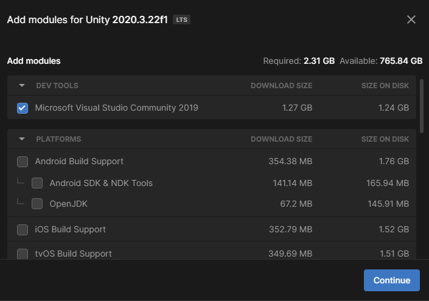

## Install Unity

If Unity is **not already installed** on your computer, then you will need to downlaod and install the software.

--- task ---

Visit [unity.com/download](https://unity.com/download) and click the link to download for **your** operating system.

--- /task ---

--- task ---

Open **Unity Hub** if it does not open automatically. You will be presented with a screen to **Install Unity Editor**. Click the button to **Install Unity Editor**.

The install process will take some time.

--- /task ---

--- task ---

Once Unity Hub has finished installing the Unity Editor, you should find it in your application launcher for your operating system.

--- /task ---

To write code for Unity you will need a code editor. Many different code editors can be used, but Visual Studio Community Edition is probably the easiest to install and use.

--- task ---

In Unity Hub, select **Installs** from the menu on the left, and then click on the gear icon to the right of your Unity version and select **Add modules**.

Make sure the checkbox next to Microsoft Visual Studio Community has been checked, and then click the **Continue** button.

--- /task ---

--- task ---

Read the licensing terms and then if you agree, check the box and click the **Install** button.

--- /task ---

--- task --- 

Once the installation of Visual Studio has completed **restart your computer**, then open Unity. Click on **Edit** and then choose **Preferences** from the menu.

In the menu on the left, select **External Tools** and in the drop-down menu for **External Script Editor** choose **Visual Studio 2019**.

--- /task ---