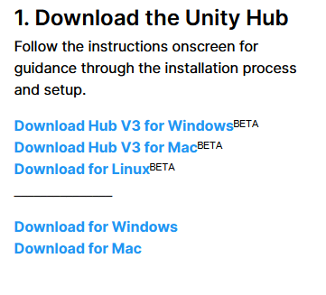
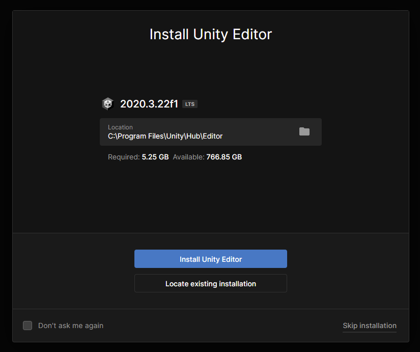

## Install Unity

### Install the Unity Editor

If the Unity Editor is **not already installed** on your computer, then you will need to download it and install the software.

--- task ---

Visit [unity.com/download](https://unity.com/download){:target="_blank"} and click the link to download the version for **your** operating system.

--- /task ---

--- task ---

Open **Unity Hub** if it does not open automatically.

You will be prompted to 'Sign In' or 'Create account'.

If you are using an education grant education license then enter the ID you have been provided with.

If you are using a personal Unity ID then use your existing details or create a new account.

Creating a Unity account has different age eligibility criteria in different countries. 

Please check the [Unity Terms of Service](https://unity3d.com/legal/terms-of-service){:target="_blank"} for further details. 

--- /task ---

--- task ---

 You will be presented with a screen to **Install Unity Editor**. Click the button to **Install Unity Editor**.

The install process will take some time.

--- /task ---

--- task ---

Once Unity Hub has finished installing the Unity Editor, you should find it in your application launcher for your operating system.

--- /task ---

Further information:
+ [Unity Tutorial: Install the Unity Hub and Editor](https://learn.unity.com/tutorial/install-the-unity-hub-and-editor){:target="_blank"}
