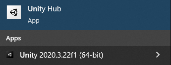

## Installer Unity

### Installer l'éditeur Unity

Si l'éditeur Unity n'est **pas déjà installé** sur ton ordinateur, tu devras le télécharger et l'installer.

--- task ---

Visite [unity.com/download](https://unity.com/download){:target="_blank"} et clique sur le lien pour télécharger la version pour **ton** système d'exploitation.

--- /task ---

--- task ---

Ouvre **Unity Hub** s'il ne s'ouvre pas automatiquement.

Tu seras invité à « Connexion » ou « Créer un compte ».

Si tu utilises une licence Education Grant, saisis l'identifiant qui t'a été fourni.

Si tu utilises un identifiant Unity personnel, utilise tes informations existantes ou crée un nouveau compte.

La création d'un compte Unity a des critères d'éligibilité différents selon les pays.

Consulte les [Conditions d'utilisation d'Unity](https://unity3d.com/legal/terms-of-service){:target="_blank"} pour plus de détails.

--- /task ---

--- task ---

 Un écran **Install Unity Editor** s'affichera. Clique sur le bouton pour **Install Unity Editor**.

Le processus d'installation prendra un certain temps.

--- /task ---

--- task ---

Une fois que Unity Hub a terminé l'installation de Unity Editor, tu devrais le trouver dans le lanceur d'applications de ton système d'exploitation.

--- /task ---

Informations complémentaires :
+ [Unity Tutorial: Install the Unity Hub and Editor](https://learn.unity.com/tutorial/install-the-unity-hub-and-editor){:target="_blank"}
