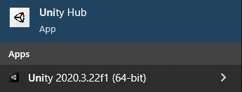

## Installeer Unity

### Installeer de Unity Editor

Als de Unity Editor **nog niet is geïnstalleerd** op je computer, moet je het downloaden en de software installeren.

--- task ---

Ga naar [unity.com/download](https://unity.com/download){:target="_blank"} en klik op de link om de versie voor **je** besturingssysteem te downloaden.

--- /task ---

--- task ---

Open **Unity Hub** als deze niet automatisch wordt geopend.

Je wordt gevraagd om je aan te melden of een account te maken.

Als je een onderwijslicentie gebruikt, voer dan de ID in die je hebt gekregen.

Als je een persoonlijke Unity ID gebruikt, gebruik dan je bestaande gegevens of maak een nieuw account.

Het maken van een Unity-account heeft verschillende leeftijdscriteria in verschillende landen.

Raadpleeg de [Unity Servicevoorwaarden](https://unity3d.com/legal/terms-of-service){:target="_blank"} voor meer informatie.

--- /task ---

--- task ---

 Je krijgt een scherm met **Install Unity Editor**. Klik op de knop om **Install Unity Editor** te installeren.

Het installatieproces duurt enige tijd.

--- /task ---

--- task ---

Als Unity Hub klaar is met het installeren van de Unity Editor, moet je het vinden in de applicatie-startprogramma voor je besturingssysteem.

--- /task ---

Meer informatie:
+ [Unity Tutorial: Installeer de Unity Hub and Editor](https://learn.unity.com/tutorial/install-the-unity-hub-and-editor){:target="_blank"}
