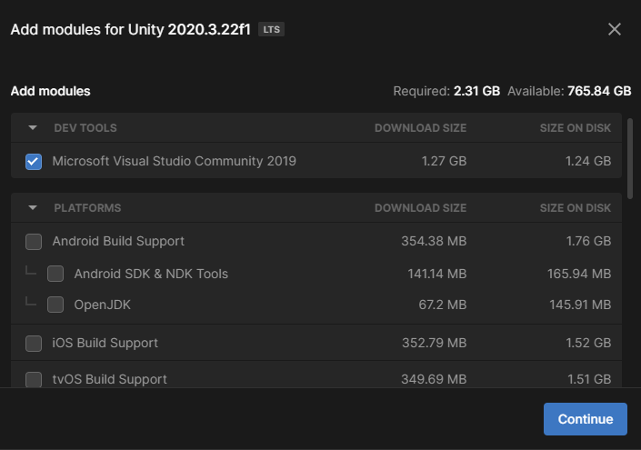
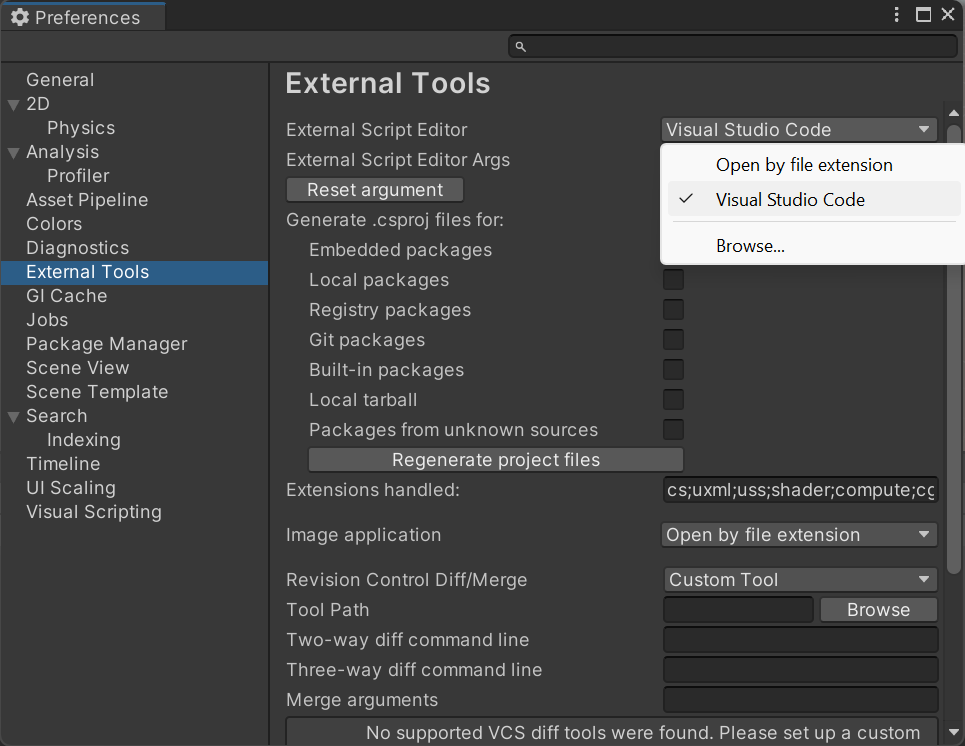

## Installeer Visual Studio

Unity gebruikt de programmeertaal C#, die wordt gebruikt door professionele software-ontwikkelaars. Om code te schrijven voor Unity moet je een externe code-editor toevoegen.

Er kunnen veel verschillende code-editors worden gebruikt, maar de aanbevolen editor is Microsoft Visual Studio. Het integreert goed met de Unity editor door het verstrekken van handige debugging en het voltooien van code om typen en fouten te verminderen.

--- task ---

Selecteer in Unity Hub **installs** in het menu aan de linkerkant, en klik vervolgens op het tandwielpictogram rechts van de Unity-versie en selecteer **Add modules**.

Zorg ervoor dat het selectievakje naast Microsoft Visual Studio Community is ingeschakeld en klik vervolgens op de knop **Continue**.

--- /task ---

--- task ---

Lees de licentievoorwaarden en vink het selectievakje aan als je akkoord gaat en klik op de knop **install**.

--- /task ---

--- task --- 

Zodra de installatie van Visual Studio is voltooid **herstart je computer** en open je Unity. Klik op **Edit** en kies vervolgens **Preferences** in het menu.

Selecteer in het menu aan de linkerkant **External Tools** en kies in het vervolgkeuzemenu voor **External Script Editor** **Visual Studio Community 2019**.

--- /task ---

Meer informatie:
+ [Unity tutorial: Begin met Visual Studio en Unity](https://learn.unity.com/tutorial/get-started-with-visual-studio-and-unity#){:target="_blank"}
+ [Unity tutorial: Stel je standaard scripteditor in](https://learn.unity.com/tutorial/set-your-default-script-editor-ide){:target="_blank"}